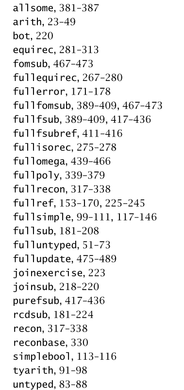

# Types and Programming Language

Decide to put the implementation of TAPL inside the Reika repo (for now).

Related issues:

- GitHub project https://github.com/at15/reika/projects/2
- [at15/mini-impl#6](https://github.com/at15/mini-impl/issues/6)
- [at15/papers-i-read#76](https://github.com/at15/papers-i-read/issues/76)

Reference OCaml implementation and chapter mapping

## Implementation

- [arith](arith.md)
- [untyped](untyped.md)
- [simplebool](simplebool.md)