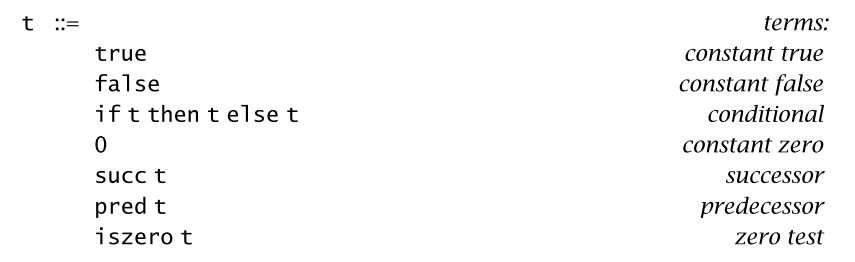
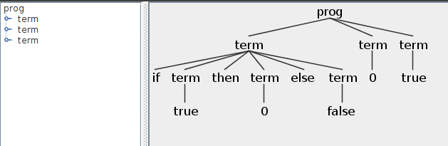

# Arith

- Chapter 4 An ML Implementation of Arithmetic Expressions
- [tapl Arithmetic #3](https://github.com/at15/reika/issues/3)
- [official OCaml implementation](https://www.cis.upenn.edu/~bcpierce/tapl/checkers/arith/)
- [Java implementation](../src/main/java/me/at15/tapl/arith)

## Syntax



[syntax.ml](https://www.cis.upenn.edu/~bcpierce/tapl/checkers/arith/syntax.ml)

````ocaml
type term =
    TmTrue of info
  | TmFalse of info
  | TmIf of info * term * term * term
  | TmZero of info
  | TmSucc of info * term
  | TmPred of info * term
  | TmIsZero of info * term

type command =
  | Eval of info * term
````

The first grammar ~~has problem~~ current grammar does not support numbers except zero ...

````
java -cp ./third_party/antlr-4.7-complete.jar:./build/libs/tapl-0.0.1-SNAPSHOT.jar org.antlr.v4.gui.TestRig me.at15.tapl.arith.Arith prog -gui
1 + 1
line 1:0 token recognition error at: '1'
line 1:2 token recognition error at: '+'
line 1:4 token recognition error at: '1'
line 2:0 mismatched input '<EOF>' expecting {'true', 'false', 'if', '0', 'succ', 'pred', 'iszero'}
````

This works

````
java -cp ./third_party/antlr-4.7-complete.jar:./build/libs/tapl-0.0.1-SNAPSHOT.jar org.antlr.v4.gui.TestRig me.at15.tapl.arith.Arith prog -gui
if true then 0 else false
0
true
````



## Evaluation

- Ocaml version is using small step, I am using big step
- `pred 0` is `0` because we are dealing with natural number

[core.ml](https://www.cis.upenn.edu/~bcpierce/tapl/checkers/arith/core.ml)

````ocaml
  | TmPred(_,TmZero(_)) ->
      TmZero(dummyinfo)
  | TmPred(_,TmSucc(_,nv1)) when (isnumericval nv1) ->
      nv1
  | TmPred(fi,t1) ->
      let t1' = eval1 t1 in
      TmPred(fi, t1')
````