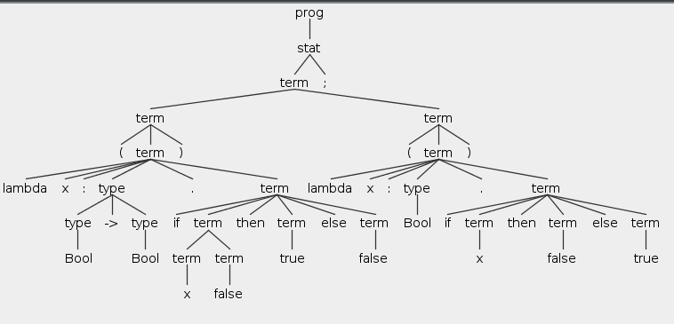

# Simple Bool

- Chapter 10 An ML Implementation of Simple Types

## Syntax

Pure simply typed lambda-calculus


test.f for simplebool

````
 lambda x:Bool. x;
 (lambda x:Bool->Bool. if x false then true else false)
   (lambda x:Bool. if x then false else true);
````

