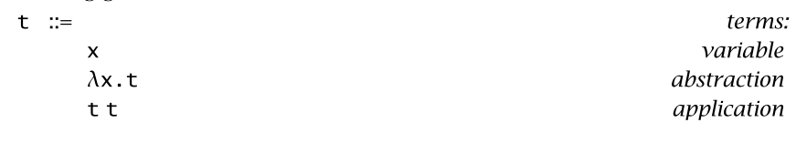
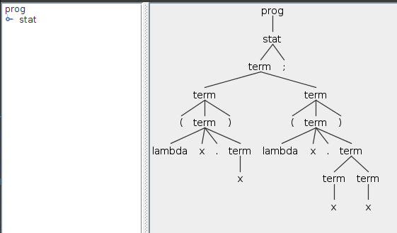

# Untyped

- Chapter 7 An ML Implementation of the Lambda-Calculus
- [tapl Untyped lambda-calculus #6](https://github.com/at15/reika/issues/6)
- [official OCaml implementation](https://www.cis.upenn.edu/~bcpierce/tapl/checkers/untyped/)

## Syntax

Pure untyped lambda calculus



test.f for untyped

````
x;

lambda x. x;
(lambda x. x) (lambda x. x x);
````

- [ ] TODO: can we have the parameter of function looks like a function, or it can only be just one ID
- [x] TODO: #7 when function body contains function application, it is not parsed properly `lambda x. x x` should have a body `x x` instead of `(lambda x. x) x`, though actually I think latter makes more sense to me, it's not what we get in the OCaml implementation
  - change order of `lambda` and `t t` solve this problem

`(lambda x. x) (lambda x. x x); `



## Evaluation

Different

- I am not using the nameless representation as suggested by the book, more discussion can be found in [this issue](https://github.com/at15/mini-impl/issues/6)
  - remember to use `Lookup` when matched a variable, so you get the bind value instead of return a raw var. i.e. `(lambda x. x) (lambda x. x x)` should return `lambda x. x x` instead of `x`
- didn't handle renaming
  - I am wondering if there is a global context in a program, if there is not, then the renaming should not happen (or it can still happen?)

Same

- when we have a unbound variable, we didn't throw error (as the OCaml implementation does), and just return it directly so `x;` can work, if in OCaml, you type `x;` in `utop`, you got error for `Ubound value x`
